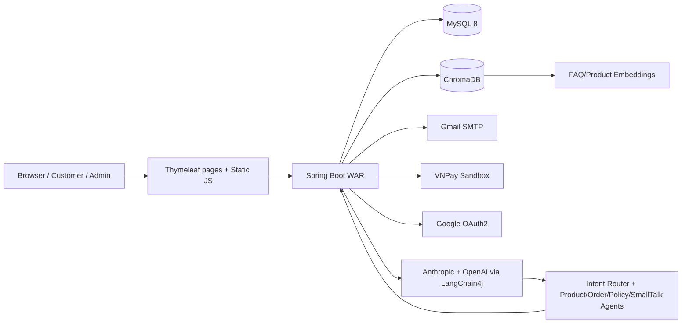

# 5A Store - AI-Powered Online Shoe Store


5A Store là một website thương mại điện tử bán giày thể thao được xây dựng bằng Spring Boot, Thymeleaf và MySQL. Điểm nổi bật của project là không chỉ dừng ở CRUD bán hàng, mà còn tích hợp chatbot AI dạng multi-agent, tìm kiếm ngữ nghĩa bằng vector database, thanh toán VNPay, quản trị đơn hàng, voucher, đánh giá sản phẩm và thông báo người dùng.

Project phù hợp để thể hiện năng lực backend/full-stack với các bài toán thực tế: thiết kế domain e-commerce, xử lý checkout/thanh toán, bảo mật JWT, tích hợp OAuth2/email, quản lý dữ liệu sản phẩm có biến thể, và ứng dụng AI/RAG vào trải nghiệm mua sắm.

## Điểm nổi bật kỹ thuật

- **E-commerce end-to-end**: danh mục sản phẩm, thương hiệu, biến thể size/màu/tồn kho, giỏ hàng, checkout nhiều bước, đơn hàng, hủy đơn, đổi trả, voucher và đánh giá.
- **AI shopping assistant**: chatbot dùng LangChain4j Agentic Services, Anthropic chat model, OpenAI embeddings và ChromaDB để tư vấn sản phẩm, chính sách và đơn hàng.
- **RAG + semantic search**: ingest FAQ từ `src/main/resources/knowledge-base/faq`, lưu embedding vào ChromaDB, hỗ trợ truy vấn chính sách và tìm kiếm sản phẩm theo ngữ nghĩa.
- **Admin operations**: dashboard thống kê, quản lý sản phẩm/variant/hình ảnh, quản lý user, đơn hàng, hoàn trả và voucher.
- **Authentication**: Spring Security stateless, JWT lưu bằng cookie, BCrypt password encoder và Google OAuth2.
- **Payment & notification**: VNPay sandbox, COD, email xác nhận đơn hàng, OTP quên mật khẩu, notification center và cấu hình WebSocket/STOMP.
- **Deployment-ready structure**: Maven wrapper, WAR packaging, Dockerfile multi-stage, `docker-compose.yml` cho MySQL + ChromaDB + app, cấu hình Railway.

## Tech stack

| Layer | Công nghệ |
| --- | --- |
| Backend | Java 17, Spring Boot 3.5.8, Spring MVC, Spring Data JPA, Spring Security, Validation |
| View/UI | Thymeleaf, HTML/CSS/JavaScript, Bootstrap/Tailwind-style utility classes ở template |
| Database | MySQL 8, Hibernate/JPA |
| AI | LangChain4j, Anthropic Chat Model, OpenAI Embedding Model, ChromaDB |
| Auth | JWT cookie auth, refresh token, BCrypt, Google OAuth2 |
| Payment | VNPay sandbox, COD, refund flow |
| Messaging | Spring WebSocket/STOMP |
| Email | Spring Mail/Gmail SMTP |
| Build/Deploy | Maven, WAR, Docker, Docker Compose, Railway |

## Kiến trúc tổng quan



## Chức năng chính

### Khách hàng

- Xem trang chủ, danh sách sản phẩm, chi tiết sản phẩm.
- Lọc/tìm kiếm sản phẩm theo danh mục, thương hiệu, tên và tìm kiếm ngữ nghĩa.
- Thêm sản phẩm vào giỏ hàng theo size/màu, cập nhật số lượng, đổi variant, xóa mềm item.
- Checkout nhiều bước, lưu địa chỉ giao hàng, áp dụng voucher.
- Thanh toán COD hoặc tạo URL thanh toán VNPay.
- Xem lịch sử đơn hàng, chi tiết đơn, hủy đơn, xác nhận đã nhận hàng, yêu cầu đổi trả.
- Đánh giá sản phẩm sau khi đơn hoàn tất, upload hình ảnh review.
- Nhận thông báo đơn hàng, thanh toán, voucher.
- Trò chuyện với chatbot AI để hỏi sản phẩm, tồn kho, chính sách và thông tin đơn hàng.

### Admin

- Dashboard tổng quan và báo cáo chi tiết.
- Quản lý sản phẩm, upload ảnh, quản lý variant size/màu/tồn kho.
- Quản lý user, trạng thái hoạt động và role.
- Quản lý đơn hàng: xác nhận, giao hàng, xóa/hủy, xử lý đổi trả.
- Quản lý voucher: tạo voucher, phạm vi áp dụng theo toàn shop/danh mục/thương hiệu/sản phẩm, bật/tắt trạng thái, xóa voucher hết hạn.

### AI/RAG

- `IntentRouter` phân loại intent.
- `ProductExpertAgent` dùng tool tìm kiếm sản phẩm và tồn kho.
- `OrderExpertAgent` dùng tool truy vấn đơn hàng.
- `PolicyExpertAgent` dùng retriever từ FAQ embedding.
- `SmallTalkAgent` xử lý hội thoại thông thường.
- Log agent, tool call và response theo session trong `logs/agent`.
- API giám sát agent tại `/api/agent-monitor`.

## Cấu trúc thư mục

```text
online_shoe_store/
├── src/main/java/com/example/online_shoe_store/
│   ├── Config/                 # Security, WebSocket, payment, MVC static resources
│   ├── Controller/             # MVC pages, REST API, admin, checkout, payment
│   ├── Entity/                 # JPA entities và enums
│   ├── Repository/             # Spring Data repositories
│   ├── Security/               # JWT, refresh token, OAuth2 handlers
│   ├── Service/                # Business logic
│   │   └── ai/                 # Agent, RAG, tools, model/vector config, monitoring
│   ├── dto/                    # Request/response/projection DTOs
│   ├── mapper/                 # MapStruct mappers
│   └── exception/              # Business/payment/order exceptions
├── src/main/resources/
│   ├── templates/              # Thymeleaf pages/fragments/email templates
│   ├── static/                 # CSS, JS, images, videos
│   ├── knowledge-base/faq/     # Markdown FAQ dùng cho RAG
│   └── application.properties  # Local Spring config
├── src/data/
│   ├── images/                 # Product/category seed images
│   └── script_sql/             # MySQL dump seed data
├── data/images/                # Runtime uploads
├── Dockerfile
├── docker-compose.yml
├── railway.toml
└── pom.xml
```

## API và route tiêu biểu

| Nhóm | Route |
| --- | --- |
| Pages | `/`, `/home`, `/products`, `/product-detail/{id}`, `/profile`, `/orders`, `/checkout/step1` |
| Auth | `/login`, `/register`, `/forgot-password`, `/oauth2/authorization/google` |
| Product | `/api/products`, `/api/products/{id}`, `/api/search/semantic`, `/api/categories`, `/api/brands` |
| Cart/Checkout | `/api/cart`, `/api/cart/add`, `/api/checkout/data`, `/api/checkout/place-order` |
| Orders | `/api/orders/my-orders`, `/api/orders/{orderId}`, `/api/admin/orders` |
| Payment | `/api/payments/create`, `/api/payments/vnpay/callback`, `/api/payments/refund` |
| Review | `/api/reviews`, `/api/reviews/pending`, `/api/reviews/product/{productId}` |
| Voucher | `/api/vouchers`, `/api/vouchers/valid`, `/api/vouchers/apply` |
| AI Chat | `/api/chat/send`, `/api/agent-monitor/**` |
| Admin UI | `/admin/dashboard`, `/admin/users`, `/admin/products`, `/admin/orders`, `/admin/returns`, `/admin/vouchers` |

## Yêu cầu môi trường

- Java 17+ để chạy local bằng Maven. Docker image hiện build/run bằng Eclipse Temurin 21 nhưng project source config là Java 17.
- Maven Wrapper có sẵn (`mvnw`, `mvnw.cmd`).
- Docker Desktop nếu chạy bằng Docker Compose.
- MySQL 8.
- ChromaDB 0.4.24 cho vector search/RAG.
- API key Anthropic và OpenAI nếu chạy đầy đủ chatbot/embedding. Các bean AI hiện được khởi tạo khi app start, nên môi trường chạy thực tế cần cấu hình key hợp lệ hoặc cần tách/disable AI config.

## Cấu hình môi trường

Tạo file `.env` ở root project khi chạy bằng Docker. Không commit `.env`; file này đã được đưa vào `.gitignore`.

```env
MYSQL_ROOT_PASSWORD=change_me
MYSQL_DATABASE=shoe_store
MYSQL_USERNAME=root
MYSQL_PASSWORD=change_me
MYSQL_PORT=3306

APP_PORT=8080
APP_BASE_URL=http://localhost:8080
CHROMA_PORT=8001

JWT_SECRET=change_me_at_least_32_characters

OPENAI_API_KEY=sk-your-openai-key
OPENAI_EMBEDDING_MODEL=text-embedding-3-small
ANTHROPIC_API_KEY=sk-ant-your-anthropic-key
ANTHROPIC_MODEL_WORKER=claude-3-5-haiku-20241022
ANTHROPIC_MODEL_ORCHESTRATOR=claude-3-5-haiku-20241022

VNPAY_TMN_CODE=your_vnpay_tmn_code
VNPAY_HASH_SECRET=your_vnpay_hash_secret
REFUND_IP=localhost:8080

MAIL_USERNAME=your_email@gmail.com
MAIL_PASSWORD=your_gmail_app_password
SUPPORT_EMAIL=your_support_email@gmail.com

GOOGLE_CLIENT_ID=your_google_client_id.apps.googleusercontent.com
GOOGLE_CLIENT_SECRET=your_google_client_secret
```

Lưu ý: service MySQL trong `docker-compose.yml` chỉ tạo root user mặc định. Nếu giữ `MYSQL_USERNAME=root`, hãy đặt `MYSQL_PASSWORD` trùng với `MYSQL_ROOT_PASSWORD`. Nếu muốn dùng user riêng, cần bổ sung `MYSQL_USER`/`MYSQL_PASSWORD` cho service MySQL hoặc tạo user trong database.

Nếu dùng `.env.example`, hãy đảm bảo file không còn marker merge conflict như `<<<<<<<`, `=======`, `>>>>>>>` trước khi copy sang `.env`.

## Chạy bằng Docker Compose

```bash
docker compose up -d --build
```

Truy cập:

- Web app: `http://localhost:8080`
- ChromaDB host port mặc định: `http://localhost:8001`
- MySQL host port mặc định: `localhost:3306`

Xem log:

```bash
docker compose logs -f app
docker compose logs -f mysql
docker compose logs -f chromadb
```

Dừng service:

```bash
docker compose down
```

Reset toàn bộ database/vector volume:

```bash
docker compose down -v
docker compose up -d --build
```

Database được seed từ:

```text
src/data/script_sql/dump-shoe_store-202601012053.sql
```

## Chạy local để phát triển

Cách tiện nhất là chạy MySQL và ChromaDB bằng Docker, còn Spring Boot chạy bằng Maven để dễ debug.

```bash
docker compose up -d mysql chromadb
```

Windows:

```powershell
.\mvnw.cmd spring-boot:run
```

macOS/Linux:

```bash
./mvnw spring-boot:run
```

Lưu ý về ChromaDB khi chạy hybrid: `docker-compose.yml` mặc định map ChromaDB ra host port `8001`, trong khi `application.properties` local có thể đang dùng `chroma.base.url=http://localhost:8000`. Hãy đổi `chroma.base.url` sang `http://localhost:8001` hoặc đặt `CHROMA_PORT=8000` khi start ChromaDB.

## Build và test

```bash
./mvnw test
./mvnw clean package
```

Dockerfile hiện build WAR bằng:

```bash
mvn clean package -DskipTests -B
```

Artifact runtime là file WAR được chạy bằng:

```bash
java -jar app.war
```

## Dữ liệu và file upload

- Product/category seed images nằm trong `src/data/images`.
- Runtime upload product/review images nằm trong `data/images`.
- `WebConfig` expose ảnh qua:
  - `/images/products/**`
  - `/images/categories/**`
  - `/images/reviews/**`
- FAQ dùng cho RAG nằm trong `src/main/resources/knowledge-base/faq`.

## Ghi chú triển khai và bảo mật

- Không đưa API key, OAuth secret, mail app password, JWT secret hoặc VNPay secret lên repository public.
- Nếu key từng bị commit hoặc chia sẻ, hãy rotate key trước khi public repo hoặc gửi cho nhà tuyển dụng.
- `Dockerfile` hiện healthcheck tới `/actuator/health`, nhưng `pom.xml` chưa có `spring-boot-starter-actuator`. Khi deploy production, nên thêm actuator hoặc đổi healthcheck về route đang tồn tại như `/`.
- `docker-compose.yml` đã mount SQL dump để tự khởi tạo database khi volume MySQL mới được tạo.
- Project có `railway.toml` để deploy theo Dockerfile.

## Vì sao project này đáng chú ý

Project này thể hiện khả năng xây dựng một sản phẩm full-stack có nhiều tích hợp thực tế, thay vì chỉ là demo CRUD:

- Có domain e-commerce đủ sâu: sản phẩm có variant, tồn kho, đơn hàng, thanh toán, hoàn trả, voucher và review.
- Có AI ứng dụng đúng ngữ cảnh mua sắm: agent phân tuyến intent, truy vấn sản phẩm/tồn kho, RAG chính sách và lưu lịch sử hội thoại.
- Có tư duy vận hành: Docker Compose, seed database, externalized configuration, logging agent theo session, API monitor.
- Có tích hợp production-like: JWT stateless, OAuth2, email SMTP, VNPay sandbox và cấu hình WebSocket/STOMP cho realtime.

## License

Project được xây dựng cho mục đích học tập và portfolio.
